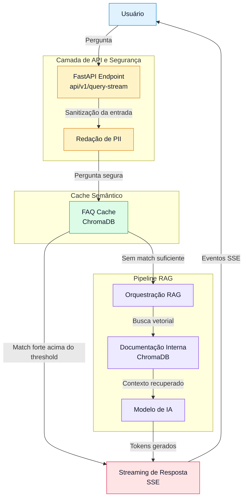

# NovaBank AI-Core: Assistente Inteligente de Atendimento (RAG Pro)


O **NovaBank AI-Core** é uma solução de inteligência artificial generativa de ponta, desenvolvida para revolucionar o atendimento ao cliente de grandes empresas. Este chatbot não apenas responde a perguntas, mas orquestra um fluxo complexo de segurança, eficiência e contextualização para entregar respostas precisas, rápidas e seguras.

A aplicação utiliza a arquitetura **RAG (Retrieval-Augmented Generation)**, potencializada por uma camada intermediária de **Cache Semântico (FAQ)** e uma camada de **Proteção de Dados Sensíveis (PII)**.


## 📊 Métricas de Sucesso da Aplicação

| Métrica | Sem AI-Core | Com AI-Core | Impacto Business |
|---|---|---|---|
| Tempo de Resposta (Média) | ~10-15 m (Humano) | < 2 s (via RAG) <br> < 100 ms (via consulta FAQ) | Aumento drástico na satisfação do cliente (CSAT) |
| Custo por Atendimento | Alto (Fator Humano) | Baixo (Tokens RAG) <br> Zero (Tokens FAQ) | Redução significativa no OPEX do Call Center |
| Taxa de Resolução (FCR) | Depende do treinamento oferecido pela empresa | Alta e Consistente (Baseada na Documentação da empresa.) | Menor reabertura de chamados |
| Risco de Vazamento de Dados | Humano/Processo | Mitigado via Software (Redação PII) | Conformidade LGPD e proteção da marca |


## 🌟 Proposta de Valor e Impacto no Negócio

Este projeto foi desenhado focando nos desafios reais de instituições financeiras modernas:

### 1. Experiência do Cliente (CX) Superior
* **Respostas Contextualizadas:** Utiliza a documentação interna real do banco para responder, garantindo acuracidade e confiança.
* **Latência Percebida Mínima:** Implementação de **Streaming de Resposta**, onde o usuário vê a resposta sendo construída em tempo real, eliminando a ansiedade da espera.

### 2. Eficiência Operacional e Redução de Custo (ROI)
* **Camada de Cache Semântico (FAQ):** Perguntas frequentes são resolvidas instantaneamente via busca vetorial em milissegundos, **sem custo de tokens de LLM** e sem latência de geração.
* **Métricas de Performance:** A API monitora o tempo médio de resposta, permitindo auditorias de eficiência.

### 3. Segurança e Conformidade (LGPD)
* **Redação de PII:** Uma camada de segurança inspeciona a pergunta do usuário e mascara dados sensíveis (CPF, Cartões, E-mails) *antes* que eles sejam enviados para modelos de IA externos, garantindo conformidade com a LGPD.

### 4. Escalabilidade e Robustez
* **Chamadas seguras e confiáveis à API** Uma integração eficiente entre **Nginx e Certbot** para servir a **API FastAPI** a diferentes tipos de aplicação.
  Construída e disponibilizada através do Aws EC2 em um container Docker, a API garante profissionalismo, segurança e confiabilidade para um projeto de **nível empresarial**.

---

## 🛠️ Arquitetura Técnica e Fluxo de Dados

A aplicação expõe um endpoint de streaming assíncrono (`api/v1/query-stream`) que orquestra o seguinte fluxo:




## 📁 Estrutura do Projeto
```
project/
├── .env                    # Para adicionar as chaves de API
├── chroma_db_faq           # Banco de dados vetorial do FAQ
├── files/                  # PDFs utilizados no sistema RAG
├── data/                   # Dados  de FAQ que vão alimentar o sistema (quanto mais completo, melhor)
│   └── faq.py              # O arquivo FAQ de perguntas e respostas prontas (dados puros)
├── functions_src/          # Módulo de funções e classes principais
│   ├── faq_engine.py       # Lógica para criar/gerenciar o banco de FAQ
│   ├── rag_pipeline.py     # Pipeline de documentos (centraliza o pipeline dos documentos RAG)
│   └── security.py         # Segurança dos dados (Verificação e anonimização de dados sigilosos)
└── app.py                  # Aplicação FastAPI (centralizada somente a lógica principal da API)
└── Dockerfile              # Arquivo de conteinerização (para deploy rápido e eficiente)
└── docker-compose.yml      # Arquivo de orquestração completa da API FastAPI (nginx + certbot)
└── nginx.conf              # Configuração do Nginx
```

+ > Esse projeto mostra como uma integração eficiente entre diferentes tecnologias podem fornecer uma ferramente robusta e eficiência operacional, otimizando custos e 
entregando uma **experiência excepcional para os clientes.**

+ > Essa combinação poderosa pode aumentar exponencialmente não só a retenção, mas também e **aquisição de novos clientes para a empresa.**