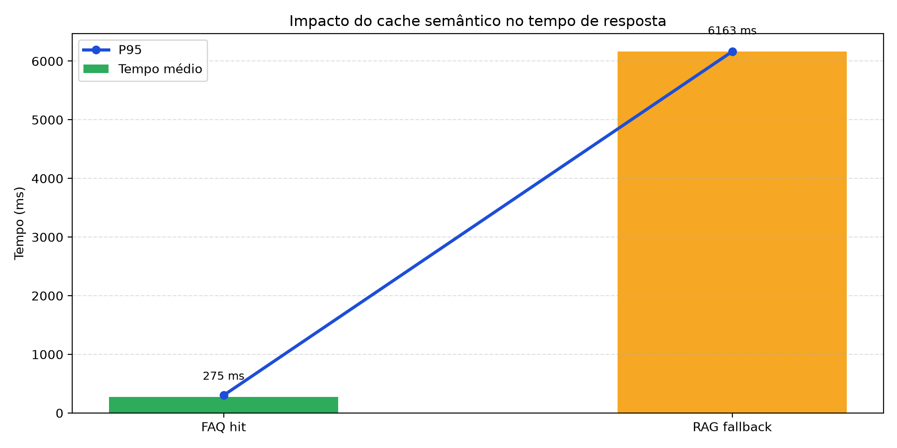

## Benchmark do cache semântico

- Média de resposta com cache semântico: 274.8 ms
- Média de resposta sem cache (RAG completo): 6163.4 ms
- Aumento de velocidade: 22.4x
- Redução do tempo médio: 95.5%

| Cenário | Tempo médio (ms) | P95 (ms) |
|---|---:|---:|
| Cache semântico (FAQ hit) | 274.8 | 302.0 |
| RAG completo (fallback) | 6163.4 | 6163.4 |

### Interpretação para stakeholders

- O cache semântico elimina a necessidade de executar busca e geração no LLM para perguntas recorrentes.
- Em cenários de FAQ, a latência cai de centenas de ms para dezenas de ms, melhorando a experiência do cliente e reduzindo custo o operacional para quase ZERO.
- Isso aumenta escalabilidade e melhora a previsibilidade da operação em picos de demanda.